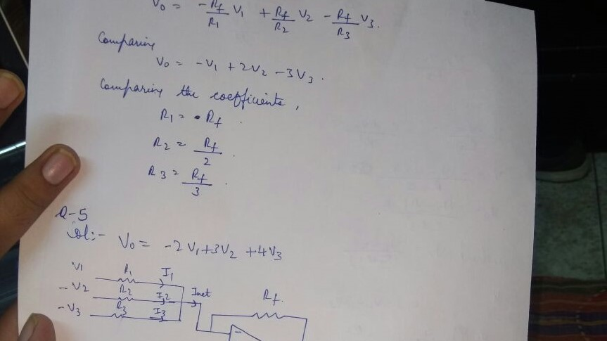
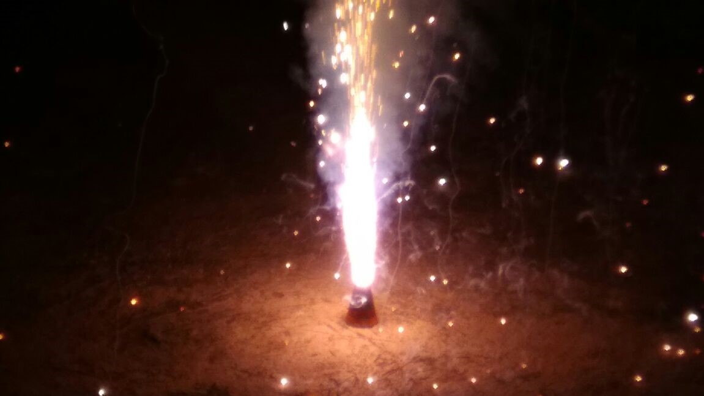

# WhatsApp Media Cleanup

This notebook was meant to be a personal exercise. I wanted to create something useful for me and practice model training as well.

## Training data:
To train the model, I created two classes `personal-photos` and `memes`. I tried to come up with 3,000 images from old cameras, my phone, a DSLR, and my parent's phones, and labelled them as `personal-photos`. For the negative class, I obtained the [Reddit Memes Dataset](https://www.kaggle.com/sayangoswami/reddit-memes-dataset/data) from Kaggle. 

## Key findings:
The model performs well enough for the task at hand, with the limited information it is given. The model tends to look at the quality of the image and if the image has text overlay or not to tell an important picture from a meme. The model performance can be improved by feeding more data from as many users as possible.

## Sample results:

Meme                        |  Personal Photo
:-------------------------:|:-------------------------:
  |  
  |  

## Todo:
* Root mobile phone, integrate notebook with `filter-media-from-contact-name` notebook.
